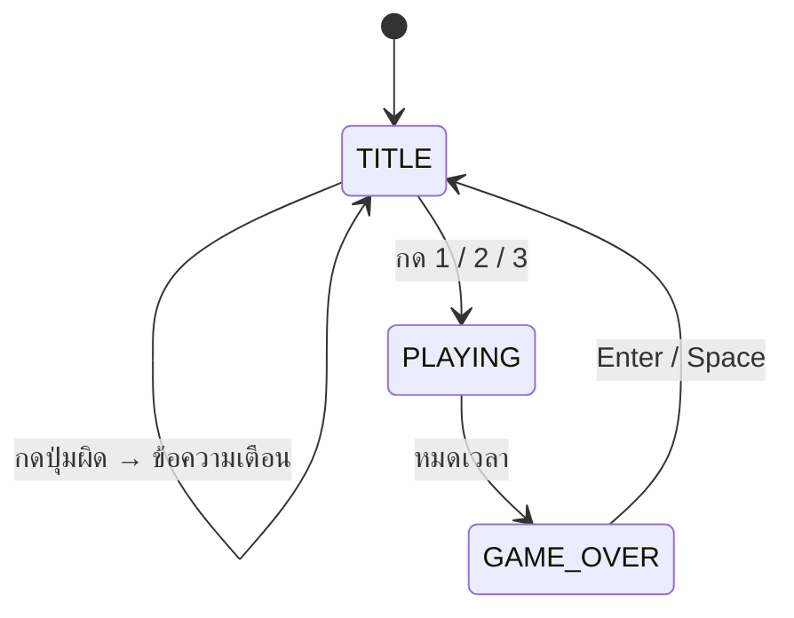

# 🎮 Mini Project Template — Raylib

โครงโปรเจกต์ตั้งต้นสำหรับ Mini Project แบบ **Raylib 5.0** (หน้าต่างกราฟิก 800×600) — compile แล้วเล่นได้ทันที มีโครงสร้าง game loop, state (FSM), delta time และตัวอย่างการตรวจ input ผิดปกติครบ นักศึกษาต่อยอดตรงจุด `TODO` ให้เป็นไอเดียของกลุ่มเอง

## 📁 ไฟล์ในโฟลเดอร์

| ไฟล์ | ใช้ทำอะไร |
|------|----------|
| [main.c](main.c) | โค้ดตั้งต้น (ไฟล์เดียว) — เกมตัวอย่าง "เก็บดาวให้ทันเวลา" |
| [PROJECT.md](PROJECT.md) | แบบฟอร์ม spec ของกลุ่ม — แนวคิด, Flowchart, การประยุกต์เนื้อหา, test case, การใช้ AI (เรียงตามเกณฑ์คะแนน) |

## 🔧 Compile & Run

```bash
gcc -std=c99 main.c -o game -lraylib -lm -lwinmm -lgdi32
./game
```

> ต้องติดตั้ง Raylib 5.0 ตามคู่มือ setup ของรายวิชาก่อน — ถ้า compile แล้วหา `raylib.h` ไม่เจอ ให้ตรวจการติดตั้งอีกครั้ง

## 🎮 เกมตัวอย่างใน template

- หน้า Title เลือกความยาก `1` / `2` / `3` — กดปุ่มอื่นจะขึ้นข้อความเตือนสีแดง (ตัวอย่างการรับมือ **input ผิดปกติ**)
- เดินสี่เหลี่ยมสีฟ้าด้วย `W A S D` หรือลูกศร เก็บดาวสีทองได้ดวงละ 10 คะแนน — ดาวกะพริบก่อนหายไปใน 4 วินาที
- หมดเวลา 30 วินาที → GAME OVER แสดงคะแนนและ Hi-Score · `Enter` กลับหน้า Title · `Esc` ออก

## 🏗️ โครงสร้างโค้ด

ทุกเฟรมทำงานเรียงขั้นตอนเสมอ — **ใส่โค้ดใหม่ให้ถูกขั้นตอน** แล้วโปรแกรมจะยังอ่านง่ายแม้ใหญ่ขึ้น

```
main() ── while (!WindowShouldClose())
   ├─ 1. TIME    dt = GetFrameTime()
   ├─ 2. INPUT   readInput(&in)               ← อ่านปุ่มที่นี่ที่เดียว
   ├─ 3. UPDATE  updateGame(&game, &in, dt)   ← switch(state) #1: logic เท่านั้น ไม่วาด
   └─ 4. DRAW    drawGame(&game)              ← switch(state) #2: BeginDrawing ... EndDrawing
               (SetTargetFPS(60) คุมความเร็วให้แล้ว)
```



**กฎสำคัญ:** การเคลื่อนที่ทุกอย่างใช้ `ตำแหน่ง += ความเร็ว * dt` เสมอ (ความเร็วมีหน่วยเป็น pixel ต่อวินาที) เกมจึงเร็วเท่ากันทุกเครื่อง

## ✏️ จุดที่ต่อยอด (ค้นหา `TODO` ใน main.c)

| TODO | ตำแหน่ง | ไอเดียการต่อยอด |
|:----:|---------|----------------|
| 1 | `#define` ด้านบน | ขนาดตัวละคร, ความเร็ว, เวลาต่อรอบ |
| 2 | `enum GameState` | เพิ่ม `STATE_PAUSED`, `STATE_HELP`, `STATE_LEVEL_UP` — อย่าลืมเพิ่ม `case` ทั้งใน `updateGame()` และ `drawGame()` |
| 3 | `struct Game` | ชีวิต, ด่าน, `Enemy enemies[]`, ชื่อผู้เล่น |
| 4 | `readInput()` | ปุ่มใหม่ เช่น `P` หยุดเกม, `Space` ยิง, เมาส์ (`GetMousePosition`) |
| 5 | `updatePlaying()` | กติกาของกลุ่ม: ศัตรูเดิน, สิ่งกีดขวาง, ไอเทมพิเศษ, ด่านยากขึ้น |
| 6 | `updatePlaying()` / `main()` | บันทึก/โหลด Hi-Score ลงไฟล์ด้วย `fopen` / `fprintf` / `fscanf` |
| 7 | `drawTitle()` | ชื่อเกมและวิธีเล่นของกลุ่ม |
| 8 | `drawPlaying()` | วาดวัตถุใหม่ด้วยรูปทรง (`DrawRectangle`, `DrawCircle`) หรือรูปภาพ (`DrawTexture`) |
| 9 | `main()` | โหลด/ปล่อย texture และเสียง (`LoadTexture` / `UnloadTexture`, `InitAudioDevice` / `LoadSound`) |

**ฟังก์ชันช่วยที่มีให้:** `drawTextCenter("text", y, size, color)` · `blinkOn(g)` (ใช้ทำข้อความกะพริบ) · `CheckCollisionCircleRec` / `CheckCollisionRecs` ของ Raylib สำหรับตรวจชน

## 🧩 เนื้อหาที่ template ใช้อยู่แล้ว

| หัวข้อ (ตามเกณฑ์) | ตัวอย่างใน template |
|------------------|---------------------|
| Variable | `score`, `timeLeft`, `difficulty` ใน `struct Game` |
| Operation | `in->moveX * PLAYER_SPEED * dt`, `it->life > 1.0f \|\| blinkOn(g)` |
| Control | `switch (g->state)`, `if` ตรวจ input, `for` วน `items[]` |
| Function | แยกตามหน้าที่: `movePlayer`, `spawnItem`, `collectItems`, `update*`, `draw*` |
| Array | `Item items[MAX_ITEMS]`, `SPAWN_TIME[3]`, `DIFFICULTY_NAME[3]` |
| Pointer | `Game *g` / `const Game *g`, `Item *it = &g->items[i]`, `readInput(Input *in)` |

> ⚠️ ของที่มีอยู่แล้วใน template **ไม่นับเป็นคะแนนความคิดสร้างสรรค์** — กลุ่มต้องเพิ่มหรือเปลี่ยนให้เป็นไอเดียของตัวเอง และอธิบายได้ว่าส่วนที่เพิ่มใช้เนื้อหาใดอย่างไร

## 🚀 ขั้นตอนแนะนำ

1. Compile และเล่นเกมตัวอย่าง 1 รอบ แล้วอ่าน `main.c` จากบนลงล่าง
2. คุยกันในกลุ่มแล้วกรอก [PROJECT.md](PROJECT.md) หัวข้อ 💡 แนวคิด และ 🔁 Flowchart **ก่อนเขียนโค้ด**
3. เปลี่ยนทีละ `TODO` แล้ว compile + ทดสอบทุกครั้ง (อย่าแก้ทีเดียวหลายจุด)
4. ถ้าใช้รูปภาพ/เสียง ให้เก็บในโฟลเดอร์ `assets/` ข้าง `main.c` และรันเกมจากโฟลเดอร์นี้ (path สัมพัทธ์)
5. ใช้ Git commit ทุกครั้งที่ feature หนึ่งทำงานได้
6. กรอกตาราง 🧩 และ 🧪 ใน `PROJECT.md` ให้ครบ แล้วทำสไลด์ตามหัวข้อในไฟล์นั้น
