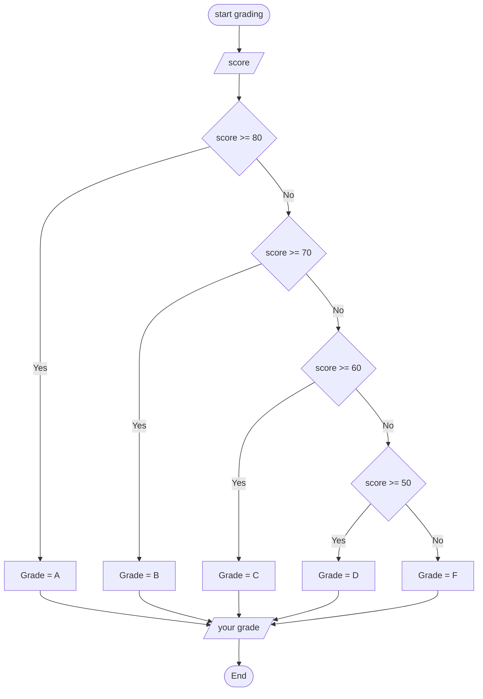

```mermaid
flowchart TD
Start([start grading]) --> Input[/ score/]
Input --> Check{score >= 80}
Check --> |Yes| A[Grade = A]
Check --> |No|Check2{score >= 70}
Check2 --> |Yes| B[Grade = B]
Check2 --> |No|Check3{score >= 60}
Check3 --> |Yes| C[Grade = C]
Check3 --> |No|Check4{score >= 50}
Check4 --> |Yes| D[Grade = D]
Check4 --> |No| F[Grade = F]
A & B & C & D & F--> Output[/ your grade/]
Output --> End([End])
```
