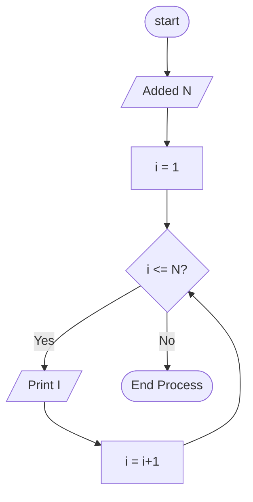

```mermaid
flowchart TD
Start([start ]) --> Input[/Added N/]
Input --> I[i = 1]
I --> Check{i <= N?}
Check -->|Yes| PrintI[/Print I/]
PrintI --> IncreaseI[i = i+1]
IncreaseI --> Check
Check -->|No| Output([End Process])

```
