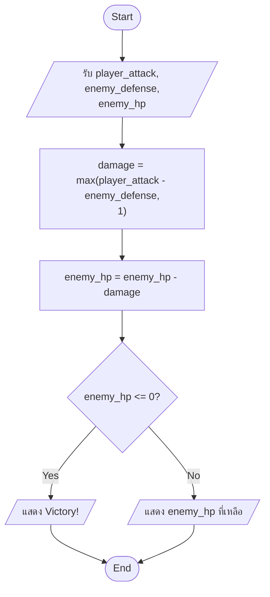
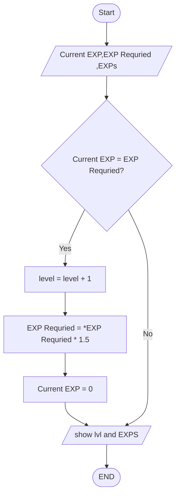
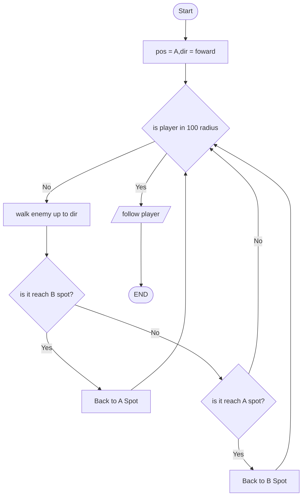

```mermaid

flowchart TD
Start([Start]) --> Input[/รับ player_attack, enemy_defense,
enemy_hp/]
Input --> Calc["damage = max(player_attack - enemy_defense,
1)"]
Calc --> Reduce["enemy_hp = enemy_hp - damage"]
Reduce --> D1{enemy_hp <= 0?}
D1 -->|Yes| Win[/แสดง Victory!/]
D1 -->|No| Show[/แสดง enemy_hp ที่เหลือ/]
Win & Show --> End([End])
```

```mermaid

flowchart TD
Start([Start]) --> EXP[/Current EXP,EXP Requried ,EXPs/]
EXP --> CHECK{Current EXP = EXP Requried?}
CHECK --> |Yes| PLUS[level = level + 1]
PLUS --> MULTIPLY[EXP Requried = *EXP Requried * 1.5]
MULTIPLY --> RESET[Current EXP = 0]
RESET --> SHOW[/show lvl and EXPS/]
CHECK --> |No| SHOW
SHOW --> Output([END])

```

```mermaid
flowchart TD
Start([Start]) --> Range[pos = A,dir = foward]
Range --> STATE{is player in 100 radius}
STATE --> |Yes| CHASE[/follow player/]
STATE --> |No| Partol[walk enemy up to dir]
Partol --> B{is it reach B spot?}
B --> |Yes| Back[Back to A Spot]
Back --> STATE
B --> |No| A{is it reach A spot?}
A --> |Yes| Back2[Back to B Spot]
Back2 --> STATE
A --> |No| STATE

CHASE--> Output([END])
```
